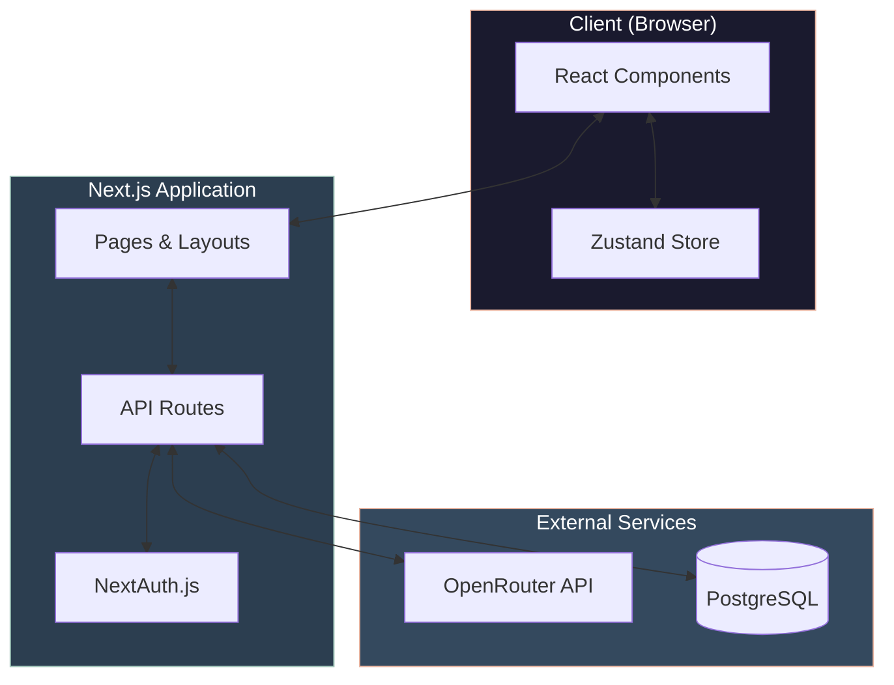
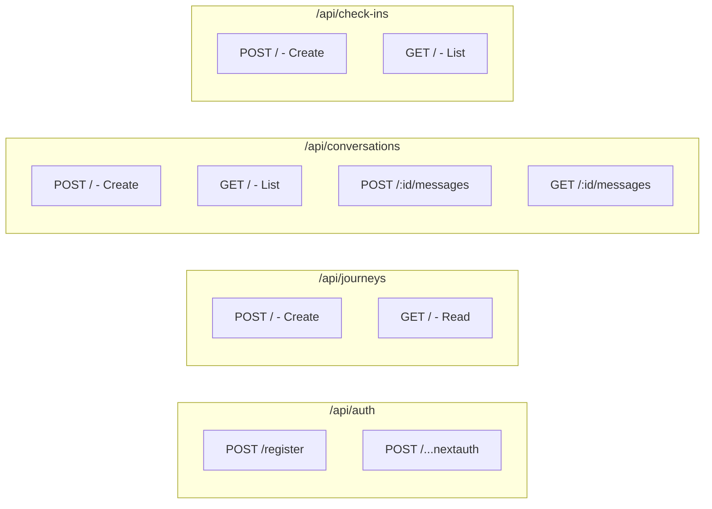
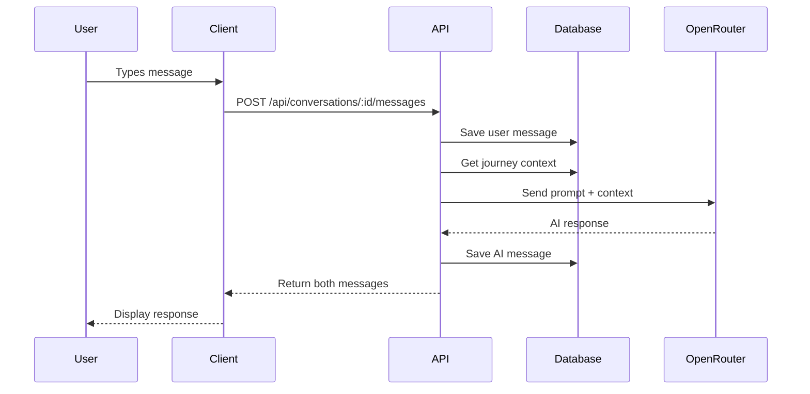

# System Architecture Diagram

## Component Details

### Client Layer
| Component | Technology | Purpose |
|-----------|------------|---------|
| React Components | Next.js + React 18 | UI rendering |
| Zustand Store | Zustand | Client-side state (onboarding) |

### Application Layer
| Component | Technology | Purpose |
|-----------|------------|---------|
| Pages | Next.js App Router | Route handling, SSR |
| API Routes | Next.js Route Handlers | REST endpoints |
| NextAuth.js | NextAuth v4 | Authentication |

### External Services
| Service | Provider | Purpose |
|---------|----------|---------|
| Database | Supabase (PostgreSQL) | Data persistence |
| AI | OpenRouter (Mistral/Llama) | Chat responses |

---

## API Routes Architecture

## Data Flow

