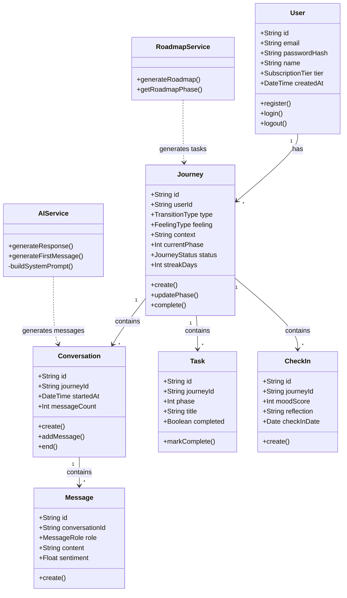
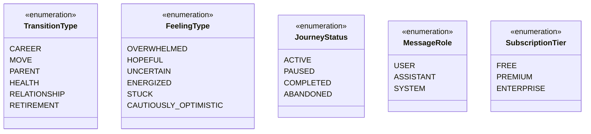

# Component Class Diagram

```mermaid
classDiagram
    class User {
        +String id
        +String email
        +String passwordHash
        +String name
        +SubscriptionTier tier
        +DateTime createdAt
        +register()
        +login()
        +logout()
    }

    class Journey {
        +String id
        +String userId
        +TransitionType type
        +FeelingType feeling
        +String context
        +Int currentPhase
        +JourneyStatus status
        +Int streakDays
        +create()
        +updatePhase()
        +complete()
    }

    class Conversation {
        +String id
        +String journeyId
        +DateTime startedAt
        +Int messageCount
        +create()
        +addMessage()
        +end()
    }

    class Message {
        +String id
        +String conversationId
        +MessageRole role
        +String content
        +Float sentiment
        +create()
    }

    class Task {
        +String id
        +String journeyId
        +Int phase
        +String title
        +Boolean completed
        +markComplete()
    }

    class CheckIn {
        +String id
        +String journeyId
        +Int moodScore
        +String reflection
        +Date checkInDate
        +create()
    }

    class AIService {
        +generateResponse()
        +generateFirstMessage()
        -buildSystemPrompt()
    }

    class RoadmapService {
        +generateRoadmap()
        +getRoadmapPhase()
    }

    User "1" --> "*" Journey : has
    Journey "1" --> "*" Conversation : contains
    Journey "1" --> "*" Task : contains
    Journey "1" --> "*" CheckIn : contains
    Conversation "1" --> "*" Message : contains
    AIService ..> Conversation : generates messages
    RoadmapService ..> Journey : generates tasks
```

## Enums

```mermaid
classDiagram
    class TransitionType {
        <<enumeration>>
        CAREER
        MOVE
        PARENT
        HEALTH
        RELATIONSHIP
        RETIREMENT
    }

    class FeelingType {
        <<enumeration>>
        OVERWHELMED
        HOPEFUL
        UNCERTAIN
        ENERGIZED
        STUCK
        CAUTIOUSLY_OPTIMISTIC
    }

    class JourneyStatus {
        <<enumeration>>
        ACTIVE
        PAUSED
        COMPLETED
        ABANDONED
    }

    class MessageRole {
        <<enumeration>>
        USER
        ASSISTANT
        SYSTEM
    }

    class SubscriptionTier {
        <<enumeration>>
        FREE
        PREMIUM
        ENTERPRISE
    }
```
