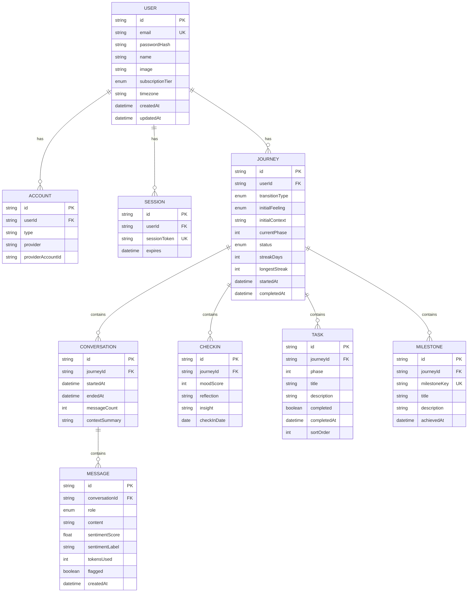

# Database Entity Relationship Diagram

## Tables Explained

| Table | Purpose |
|-------|---------|
| **USER** | Stores user accounts (email, password, preferences) |
| **JOURNEY** | One per user - their transition journey (career, move, etc.) |
| **CONVERSATION** | Chat sessions between user and AI |
| **MESSAGE** | Individual messages in a conversation |
| **CHECKIN** | Daily mood check-ins (1-5 score) |
| **TASK** | Roadmap tasks across 4 phases |
| **MILESTONE** | Achievements (first_conversation, week_1_complete, etc.) |
| **ACCOUNT** | OAuth provider accounts (Google, GitHub) |
| **SESSION** | Active login sessions |
