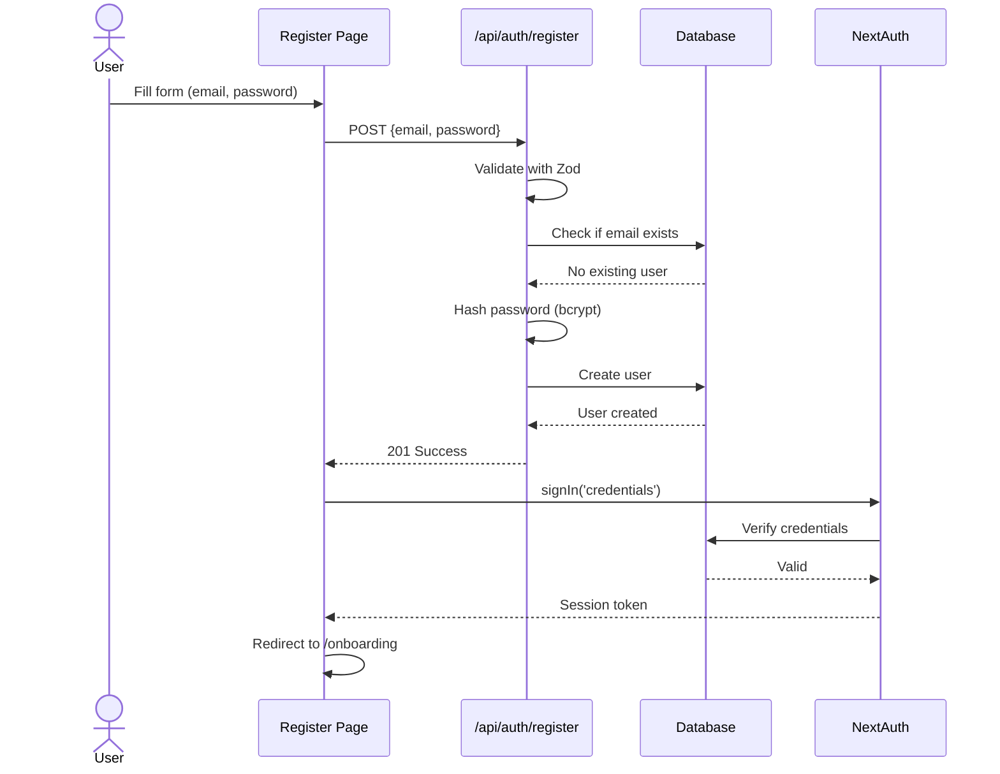
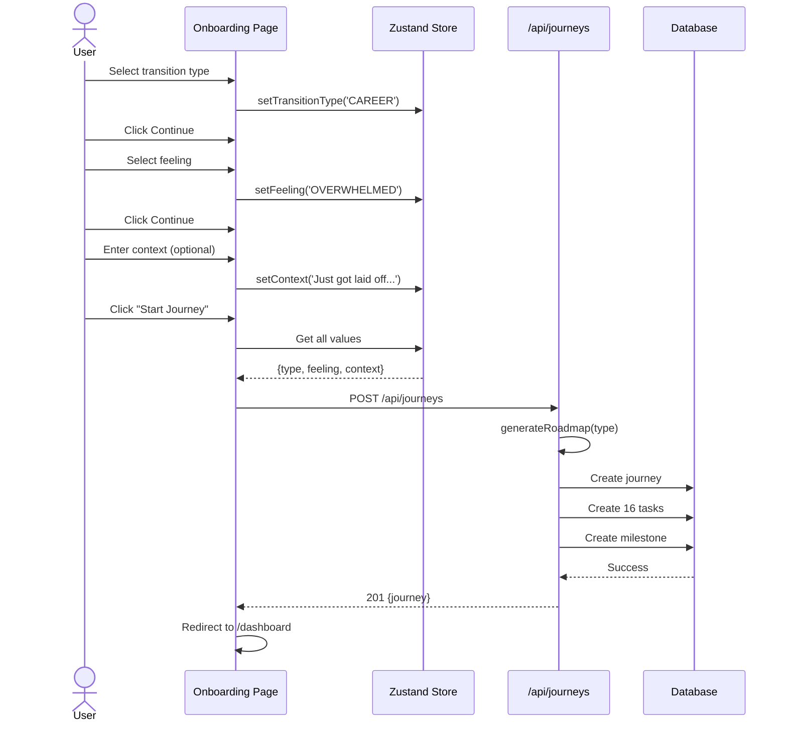
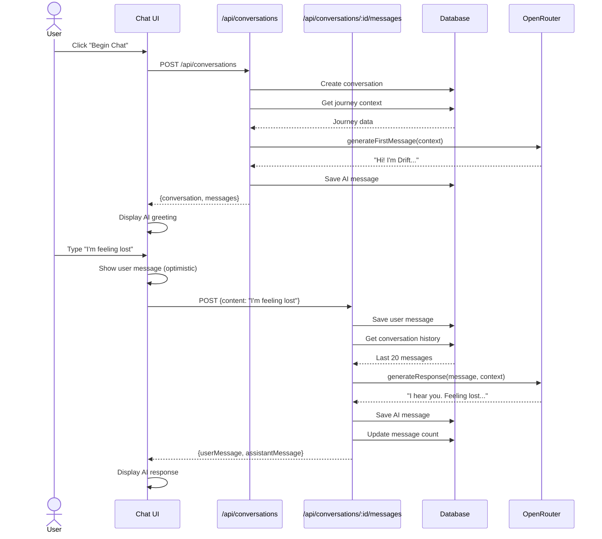
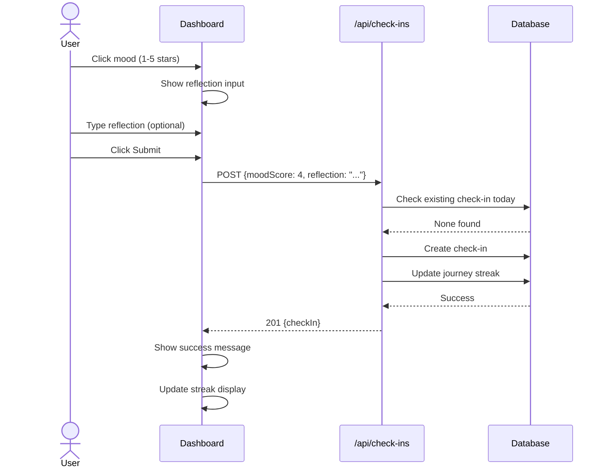
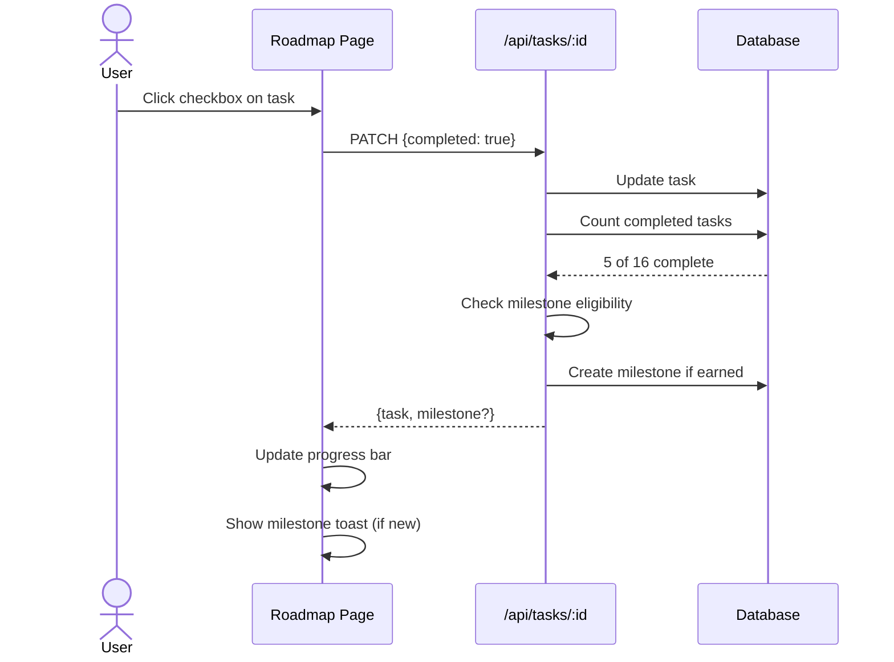

# Sequence Diagrams

## 1. User Registration Flow

```mermaid
sequenceDiagram
    actor U as User
    participant P as Register Page
    participant A as /api/auth/register
    participant D as Database
    participant N as NextAuth

    U->>P: Fill form (email, password)
    P->>A: POST {email, password}
    A->>A: Validate with Zod
    A->>D: Check if email exists
    D-->>A: No existing user
    A->>A: Hash password (bcrypt)
    A->>D: Create user
    D-->>A: User created
    A-->>P: 201 Success
    P->>N: signIn('credentials')
    N->>D: Verify credentials
    D-->>N: Valid
    N-->>P: Session token
    P->>P: Redirect to /onboarding
```

## 2. Onboarding Flow

```mermaid
sequenceDiagram
    actor U as User
    participant O as Onboarding Page
    participant S as Zustand Store
    participant A as /api/journeys
    participant D as Database

    U->>O: Select transition type
    O->>S: setTransitionType('CAREER')
    U->>O: Click Continue
    
    U->>O: Select feeling
    O->>S: setFeeling('OVERWHELMED')
    U->>O: Click Continue
    
    U->>O: Enter context (optional)
    O->>S: setContext('Just got laid off...')
    U->>O: Click "Start Journey"
    
    O->>S: Get all values
    S-->>O: {type, feeling, context}
    O->>A: POST /api/journeys
    A->>A: generateRoadmap(type)
    A->>D: Create journey
    A->>D: Create 16 tasks
    A->>D: Create milestone
    D-->>A: Success
    A-->>O: 201 {journey}
    O->>O: Redirect to /dashboard
```

## 3. Chat Flow

```mermaid
sequenceDiagram
    actor U as User
    participant C as Chat UI
    participant A1 as /api/conversations
    participant A2 as /api/conversations/:id/messages
    participant D as Database
    participant AI as OpenRouter

    U->>C: Click "Begin Chat"
    C->>A1: POST /api/conversations
    A1->>D: Create conversation
    A1->>D: Get journey context
    D-->>A1: Journey data
    A1->>AI: generateFirstMessage(context)
    AI-->>A1: "Hi! I'm Drift..."
    A1->>D: Save AI message
    A1-->>C: {conversation, messages}
    C->>C: Display AI greeting

    U->>C: Type "I'm feeling lost"
    C->>C: Show user message (optimistic)
    C->>A2: POST {content: "I'm feeling lost"}
    A2->>D: Save user message
    A2->>D: Get conversation history
    D-->>A2: Last 20 messages
    A2->>AI: generateResponse(message, context)
    AI-->>A2: "I hear you. Feeling lost..."
    A2->>D: Save AI message
    A2->>D: Update message count
    A2-->>C: {userMessage, assistantMessage}
    C->>C: Display AI response
```

## 4. Daily Check-in Flow

```mermaid
sequenceDiagram
    actor U as User
    participant D as Dashboard
    participant A as /api/check-ins
    participant DB as Database

    U->>D: Click mood (1-5 stars)
    D->>D: Show reflection input
    U->>D: Type reflection (optional)
    U->>D: Click Submit
    D->>A: POST {moodScore: 4, reflection: "..."}
    A->>DB: Check existing check-in today
    DB-->>A: None found
    A->>DB: Create check-in
    A->>DB: Update journey streak
    DB-->>A: Success
    A-->>D: 201 {checkIn}
    D->>D: Show success message
    D->>D: Update streak display
```

## 5. Task Completion Flow

```mermaid
sequenceDiagram
    actor U as User
    participant R as Roadmap Page
    participant A as /api/tasks/:id
    participant D as Database

    U->>R: Click checkbox on task
    R->>A: PATCH {completed: true}
    A->>D: Update task
    A->>D: Count completed tasks
    D-->>A: 5 of 16 complete
    A->>A: Check milestone eligibility
    A->>D: Create milestone if earned
    A-->>R: {task, milestone?}
    R->>R: Update progress bar
    R->>R: Show milestone toast (if new)
```
