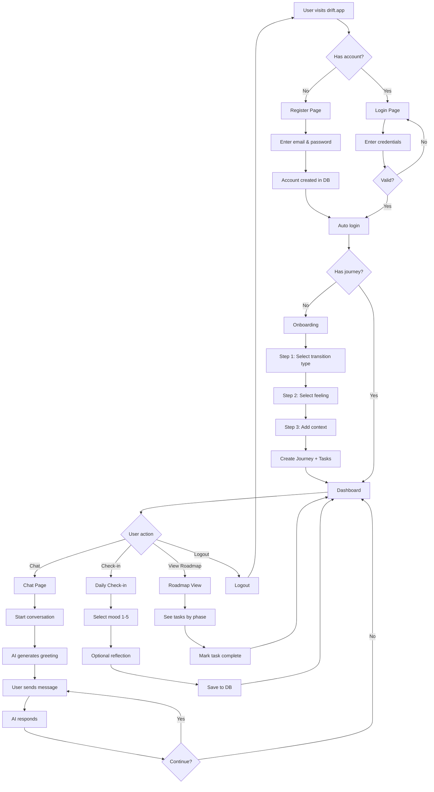

# User Flow Diagram

## Flow Explained

1. **Entry**: User lands on homepage
2. **Auth**: Register or login
3. **Onboarding**: First-time users complete 3 steps
4. **Dashboard**: Central hub for all features
5. **Chat**: Talk to AI companion
6. **Check-in**: Daily mood tracking
7. **Roadmap**: View and complete tasks
